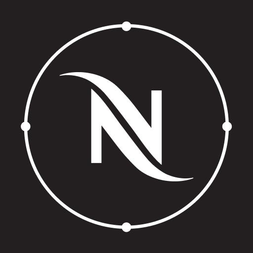

  

# Nespresso Smart - Home Assistant Integration

A Home Assistant custom integration for Nespresso Smart coffee machines via Bluetooth Low Energy (BLE).

Built by reverse-engineering the Nespresso Smart Android app (v1.2.5).

> **Screenshot wanted:** If you have a Nespresso machine paired with this integration, please submit a screenshot of the HA device page via a [GitHub issue](https://github.com/renaudallard/homeassistant_nespresso_smart/issues).

---

## Supported Machines

| Family | BLE Service UUID | Machines |
|--------|-----------------|----------|
| Barista (Original) | `65241910-0253-11E7-93AE-92361F002671` | Barista |
| Vertuo Next (Venus) | `06AA1910-F22A-11E3-9DAA-0002A5D5C51B` | VertuoNext, VertuoPop, VertuoPopPlus, VertuoLattissima, VertuoCreatista, VertuoUp |
| VMini | `96600100-526E-4676-A11A-AF1EB848165B` | Vertuo Mini |

## Installation

### HACS (recommended)

1. Open HACS in your Home Assistant instance
2. Go to **Integrations**
3. Click the three dots in the top right corner and select **Custom repositories**
4. Add `https://github.com/renaudallard/homeassistant_nespresso_smart` with category **Integration**
5. Click **Add**
6. Search for "Nespresso Smart" in HACS and install it
7. Restart Home Assistant

### Manual

Copy `custom_components/nespresso/` into your Home Assistant `config/custom_components/` directory and restart Home Assistant.

### Setup

After installation, the integration will auto-discover Nespresso machines via Bluetooth. Ensure your machine is powered on and within BLE range.

During setup, you can optionally provide an **auth token** (16 hex characters). This is only needed if the machine is already paired with the Nespresso app and you don't want to reset it. If left empty, the integration generates a new token and onboards the machine (requires pressing the Bluetooth pairing button on the machine first).

### Machine already paired with the Nespresso app

Each machine stores one auth token (CMID). If the Nespresso app already onboarded it, the integration needs the same token or the machine needs to be reset. Two options:

**Option A: Reset the machine (simplest)**

Press the Bluetooth pairing button on the machine (usually hold the main button for 5-7 seconds while on). This resets the stored auth token. The integration will onboard with a new token. The Nespresso app will need to re-pair afterward.

**Option B: Extract the existing token**

Capture the auth token from the Nespresso app using Android's BLE logging:

1. On your Android phone, enable **Developer Options** (Settings > About > tap Build Number 7 times)
2. In Developer Options, enable **Bluetooth HCI snoop log**
3. Open the Nespresso app and let it connect to the machine
4. Disable Bluetooth HCI snoop log
5. Pull the log: `adb pull /data/misc/bluetooth/logs/btsnoop_hci.log` (or find it at the path shown in Developer Options)
6. Open in **Wireshark**, filter: `btatt.handle` and look for a Write Request to the auth characteristic (UUID `06aa3a41` for Vertuo Next, `65243a41` for Barista)
7. The 8-byte value written is the auth token. Convert to 16 hex characters and enter it during setup.

### Requirements

- Home Assistant 2026.03 or newer
- Bluetooth adapter accessible to Home Assistant
- Nespresso machine powered on and within BLE range

## Entities

### Sensors

| Entity | Barista | Vertuo Next | VMini | Description |
|--------|---------|-------------|-------|-------------|
| State | Yes | Yes | No | Machine operational state (enum with 32 translated states) |
| Firmware version | Yes | Yes | Yes | Current firmware version (diagnostic) |
| Hardware version | Yes | Yes | No | Hardware revision (diagnostic) |
| Bootloader version | Yes | Yes | No | Bootloader version (diagnostic) |
| Profile version | Yes | Yes | No | BLE profile version (diagnostic) |
| Bluetooth version | Yes | No | No | Bluetooth module version (diagnostic) |
| Recipe DB version | No | Yes | No | Recipe database version (diagnostic) |
| Connectivity FW | No | Yes | No | WiFi/connectivity firmware version (diagnostic) |
| Error code | No | Yes | No | Current active error code (diagnostic) |
| Error log code | No | Yes | No | Error from error log (diagnostic) |
| Capsule counter | No | Yes | No | Capsule counter |
| IoT market | No | Yes | No | IoT market name (diagnostic) |
| Recipe slots | Yes | No | No | Maximum recipe slots (diagnostic) |
| Device shadow | No | No | Yes | Device shadow JSON data (diagnostic) |
| FOTA status | No | No | Yes | Firmware update status (diagnostic) |
| FOTA progress | No | No | Yes | Firmware update progress (diagnostic) |

### Binary Sensors

| Entity | Barista | Vertuo Next | VMini | Description |
|--------|---------|-------------|-------|-------------|
| Error | Yes | Yes | No | Machine has an active error |
| Induction heater | Yes | No | No | Induction heater is active |
| Water tank empty | No | Yes | No | Water tank needs refilling |
| Descaling needed | No | Yes | No | Machine needs descaling |
| Cleaning needed | No | Yes | No | Machine needs cleaning |
| Capsule container full | No | Yes | No | Used capsule container is full |
| Milk frother | No | Yes | No | Milk frother is running |
| LED signaling | No | Yes | No | LED signaling is active |

### Controls

| Entity | Barista | Vertuo Next | VMini | Description |
|--------|---------|-------------|-------|-------------|
| Recipe | Yes | No | No | Select recipe (espresso, lungo, etc.) |
| Language | Yes | No | No | Set machine display language |
| Water hardness | No | Yes | No | Set water hardness level (0-6 slider) |
| Auto power off | No | Yes | No | Set auto power off time (minutes) |
| Check firmware update | No | No | Yes | Trigger firmware update check |

### Events and Triggers

Event entity fires on machine state changes (Barista and Vertuo Next).

Device triggers for automations:
- **brewing_started** / **brewing_finished**
- **error_occurred**
- **ready** / **standby**
- **descaling_needed** / **water_tank_empty**

### Device Info

Each machine is registered as a device with manufacturer, model, serial number, firmware version, and hardware version.

## How It Works

The integration connects to the machine via BLE at a configurable interval (default 60 seconds), reads the status characteristics, and disconnects. This avoids blocking the Nespresso mobile app from connecting.

Machine family is detected automatically from the advertised BLE service UUID during discovery. When the machine becomes available after being off or out of range, a BLE advertisement callback triggers an immediate refresh.

Authentication is application-level only (CMID write with response), matching the official Nespresso Android app. No BLE-level pairing is needed. The auth key is generated once and persisted in the config entry so the same key is reused across restarts. If the machine was previously paired with the Nespresso app, press the Bluetooth pairing button on the machine to allow re-onboarding.

## Reverse Engineering Documentation

Detailed protocol documentation from the APK decompilation is available under [docs/](docs/).

## Configuration

After adding the machine, go to **Settings > Devices & Services > Nespresso > Configure** to set:

- **Poll interval** (10-600 seconds, default 60): how often to read machine status
- **Persistent connection** (off by default): keeps the BLE connection open for real-time GATT notifications. Gives instant status updates but blocks the Nespresso mobile app.

## Limitations

- **Vertuo brewing**: Vertuo command protocol cmdID values are obfuscated in the APK. Recipe selection is only available for Barista machines. Needs BLE packet capture on real hardware.
- **Maintenance commands**: Descaling, rinsing, emptying command IDs are not in the decompiled code. Needs real hardware testing.
- **VMini WiFi**: WiFi current settings characteristic has no handler in the decompiled SDK. Byte layout unknown.
- **BLE range**: The machine must be within Bluetooth range of the Home Assistant host.
- **Single client**: Only one BLE client can connect at a time. If the Nespresso app is connected, HA will retry on the next poll.

## Support

If you find this integration useful, you can support its development:

## Contributing

To submit this integration to the HACS default repository:

1. Ensure it meets the [HACS requirements](https://hacs.xyz/docs/publish/integration)
2. Fork [hacs/default](https://github.com/hacs/default)
3. Add the repository URL to the `integration` file
4. Submit a pull request
